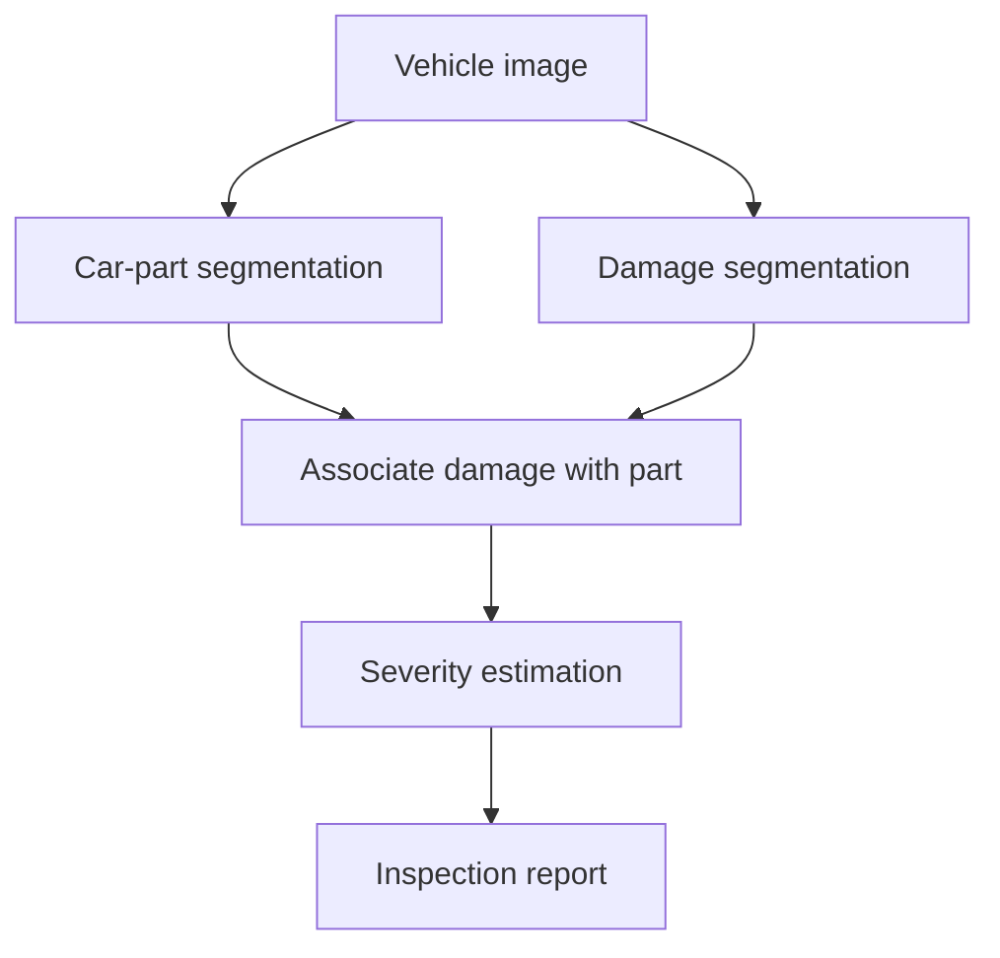

# DamageLens

DamageLens is an end-to-end vehicle damage inspection project that combines car-part segmentation, damage segmentation, severity estimation, and a deployable inspection application.

The system is designed to answer three questions from vehicle images:

- Which car part is visible or damaged?
- What type of damage is present?
- How severe is the damage?

## Planned inspection pipeline



The final application will return segmented car parts, localized damage, damage type, estimated severity, and a structured inspection summary.

## Current status

| Component | Status |
|---|---|
| Dataset audit and EDA | Completed |
| Dataset cleaning and preparation | Completed |
| Car-part Mask R-CNN | Completed |
| Car-part test evaluation | Completed |
| External-domain audit | Completed |
| CarDD damage segmentation | Next |
| Severity model | Planned |
| Part–damage association | Planned |
| Inspection application | Planned |
| Deployment | Planned |

## Datasets

All datasets use COCO instance-segmentation annotations after preparation.

| Dataset | Purpose | Train images | Validation images | Test images | Classes |
|---|---:|---:|---:|---:|---:|
| Car Parts | Part segmentation | 6,390 | 1,747 | 946 | 14 |
| CarDD | Damage segmentation | 2,816 | 810 | 374 | 6 |
| Severity | Severity estimation | 3,566 | 764 | 765 | 8 |

### Car-part classes

- Bonnet
- Front bumper
- Front door
- Front fender
- Headlights
- Rear bumper
- Rear door
- Rear fender
- Rear lamp
- Rocker panel
- Side mirror
- Trunk lid
- Wheel
- Windshield

### CarDD damage classes

- Dent
- Scratch
- Crack
- Glass shatter
- Lamp broken
- Tire flat

### Severity classes

- Minor dent
- Minor scratch
- Moderate broken
- Moderate dent
- Moderate scratch
- Severe broken
- Severe dent
- Severe scratch

The raw and processed datasets are not committed to Git because of their size and source-license requirements.

## Dataset preparation

The preparation pipeline performs:

- COCO structure and reference validation
- Image readability and dimension checks
- Invalid annotation detection
- Empty-category removal
- Exact duplicate detection
- Invalid and extremely small mask removal
- Bounding-box repair
- Source-group-aware severity splitting
- Cross-split leakage checks
- Processed dataset and manifest generation
- Final COCO integrity validation

### Preparation results

| Dataset | Images before | Images after | Annotations before | Annotations after |
|---|---:|---:|---:|---:|
| Car Parts | 9,212 | 9,083 | 26,869 | 26,507 |
| CarDD | 4,000 | 4,000 | 8,740 | 8,738 |
| Severity | 5,298 | 5,095 | 11,198 | 10,596 |

All processed splits passed the final integrity checks with:

- No duplicate image or annotation IDs
- No missing image references
- No missing category references
- No invalid bounding boxes
- No out-of-image bounding boxes
- No invalid segmentation structures

See [the dataset preparation report](docs/dataset_preparation_report.md) for the detailed decisions and limitations.

## Car-part segmentation

The first completed model is a Mask R-CNN with a ResNet-50 FPN v2 backbone.

### Architecture

| Component | Purpose |
|---|---|
| ResNet-50 backbone | Extracts visual features from the input image |
| Feature Pyramid Network | Represents large and small objects at multiple scales |
| Region Proposal Network | Generates candidate object regions |
| Detection head | Classifies parts and refines bounding boxes |
| Mask head | Produces a separate segmentation mask for every detected part |

Mask R-CNN was selected because DamageLens requires instance masks rather than only image-level labels or bounding boxes. Masks are needed later to associate each detected damage region with the correct vehicle part.

### Training configuration

| Setting | Value |
|---|---:|
| Pretraining | COCO |
| Foreground classes | 14 |
| Classes including background | 15 |
| Training batch size | 4 |
| Evaluation batch size | 2 |
| Initial learning rate | 0.005 |
| Refinement learning rate | 0.0005 |
| Momentum | 0.9 |
| Weight decay | 0.0005 |
| Mixed precision | Enabled |
| Selected checkpoint | Epoch 9 |

The model was selected using validation mask mAP. The test set was kept untouched until checkpoint selection was complete.

## Car-part results

### Validation results

| Metric | Score |
|---|---:|
| Bounding-box mAP | 0.777 |
| Bounding-box AP50 | 0.874 |
| Segmentation-mask mAP | 0.775 |
| Segmentation-mask AP50 | 0.874 |

### Test results

| Metric | Score |
|---|---:|
| Bounding-box mAP | 0.776 |
| Bounding-box AP50 | 0.870 |
| Bounding-box AP75 | 0.846 |
| Segmentation-mask mAP | 0.772 |
| Segmentation-mask AP50 | 0.868 |
| Segmentation-mask AP75 | 0.826 |
| Segmentation-mask AR100 | 0.838 |

Validation and test performance are nearly identical, indicating little same-distribution generalization gap.

### Per-class test mask mAP

| Class | Mask mAP |
|---|---:|
| Bonnet | 0.913 |
| Rear door | 0.908 |
| Trunk lid | 0.898 |
| Front bumper | 0.894 |
| Rear bumper | 0.891 |
| Front door | 0.850 |
| Rear fender | 0.832 |
| Front fender | 0.831 |
| Wheel | 0.766 |
| Side mirror | 0.745 |
| Headlights | 0.742 |
| Rear lamp | 0.738 |
| Rocker panel | 0.490 |
| Windshield | 0.303 |

Windshield performance is not reliable because the processed test set contains only three windshield annotations. Rocker-panel mask boundaries remain a genuine weakness despite better bounding-box performance.

## External-domain audit

The selected model was also tested qualitatively on 40 images from datasets that were not used to train the car-part model:

- 20 CarDD test images
- 20 Severity test images

Before inference, the sample was screened against the complete Car Parts dataset.

| Check | Result |
|---|---:|
| Exact matches | 0 |
| Likely perceptual duplicates | 0 |
| Minimum perceptual-hash distance | 8 |
| Rejection threshold | 4 |

At a confidence threshold of 0.50:

| Source | Images | Images with predictions | Average predictions | Mean confidence* |
|---|---:|---:|---:|---:|
| CarDD | 20 | 16 | 1.3 | 0.883 |
| Severity | 20 | 4 | 0.3 | 0.901 |

\*Mean image-level confidence among images containing predictions.

The model transferred well when a recognizable portion of a complete part was visible. Performance decreased substantially on tightly cropped damage images that removed the surrounding part context.

The audit also found some high-confidence false positives and incorrect part labels. Confidence alone therefore cannot be treated as a correctness guarantee outside the training distribution.

The current model is appropriate for a showcase application that requests wider vehicle or part-level photographs. It should not be presented as reliable for arbitrary extreme close-ups.

## Notebooks

| Notebook | Purpose |
|---|---|
| [`01_dataset_audit_and_eda.ipynb`](notebooks/01_dataset_audit_and_eda.ipynb) | Dataset structure, quality audit, class analysis, duplicates, leakage, and annotation review |
| [`02_prepare_datasets.ipynb`](notebooks/02_prepare_datasets.ipynb) | Cleaning, deduplication, split reconstruction, manifest generation, and final validation |
| [`03_train_part_segmentation_mask_rcnn.ipynb`](notebooks/03_train_part_segmentation_mask_rcnn.ipynb) | Mask R-CNN training, checkpoint selection, COCO evaluation, per-class analysis, and external audit |

## Repository structure

```text
DamageLens/
├── app/                       # Inspection application
├── configs/                   # Training and inference configuration
├── data/
│   ├── raw/                   # Original datasets, ignored by Git
│   ├── interim/               # Intermediate artifacts, ignored by Git
│   └── processed/             # Validated COCO datasets, ignored by Git
├── docs/                      # Reports and project documentation
├── notebooks/                 # Reproducible experiments
├── outputs/                   # Checkpoints and evaluation outputs, ignored by Git
├── scripts/                   # Training and utility entry points
├── src/damagelens/
│   ├── damage_segmentation/
│   ├── data/
│   ├── inference/
│   ├── part_segmentation/
│   ├── severity/
│   └── utils/
└── tests/
```

## Reproducing the completed work

The project was developed with:

- Python 3.11
- PyTorch 2.11
- Torchvision 0.26
- CUDA 12.8
- `pycocotools`
- pandas
- NumPy
- Pillow
- Matplotlib
- tqdm

Run the notebooks in order:

1. `01_dataset_audit_and_eda.ipynb`
2. `02_prepare_datasets.ipynb`
3. `03_train_part_segmentation_mask_rcnn.ipynb`

The raw datasets must be placed under `data/raw/` before running the preparation pipeline.

Model checkpoints are written under:

```text
outputs/part_segmentation/mask_rcnn/checkpoints/
```

They are intentionally excluded from Git.

## Next work

The next development phase will:

- Train a damage instance-segmentation model using CarDD
- Evaluate damage detection by class and object size
- Audit the damage model on external images
- Associate damage masks with predicted car-part masks
- Train and compare severity models
- Define confidence and failure-handling rules
- Build a reusable inference pipeline
- Create the inspection application
- Add model cards and deployment documentation

## Known limitations

- External auditing is currently qualitative because the external datasets do not contain car-part ground truth.
- The part model relies on visible part-level context and performs poorly on extreme close-ups.
- Some classes have limited validation and test coverage.
- The training data contains a consistent annotation and image style that may not represent every real inspection scenario.
- Damage segmentation, severity estimation, and the end-to-end application are still under development.

## License and data attribution

Project code is distributed under the repository’s [LICENSE](LICENSE).

The datasets remain subject to their respective licenses and attribution requirements. Dataset files are not redistributed through this repository.
