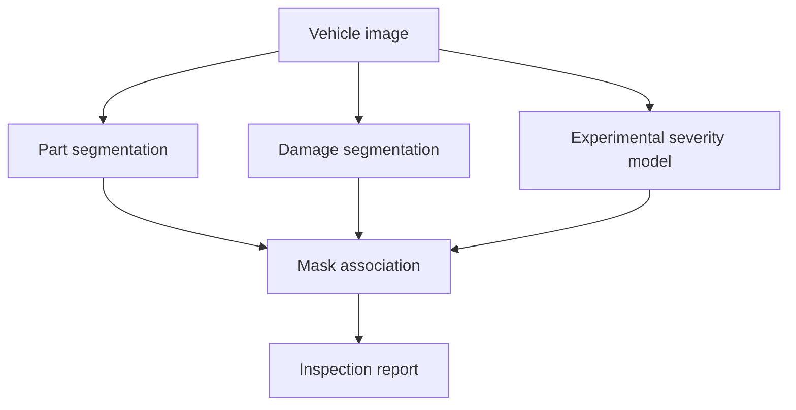

# DamageLens

DamageLens is an experimental computer vision system for vehicle-damage inspection. Given a vehicle image, the planned pipeline will identify:

1. The visible vehicle part
2. The damage type
3. The damage mask
4. An experimental severity level
5. The overlap between the damage and the affected part

The project is being built as a portfolio demonstration of dataset auditing, instance segmentation, model evaluation and application deployment.

> **Status:** Work in progress. Dataset auditing is complete, and severity-data preparation is the current stage.

## Planned output

```text
Affected part: Front bumper
Damage type: Dent
Severity: Moderate
Damage-to-part area: 18.4%
```

The damage-to-part percentage is an explainable visual measurement. It is not a repair-cost estimate.

## Pipeline



The component models use separate datasets because no selected dataset contains reliable part, damage-type and severity labels for the same images.

## Data sources

| Dataset | Role | Images | Status | Source |
|---|---|---:|---|---|
| Car Parts Instance Segmentation | Vehicle-part masks | 9,212 | Accepted with minor cleaning | [Roboflow Universe](https://universe.roboflow.com/model-examples/car-parts-instance-segmentation/dataset/3) |
| CarDD | Damage-type masks | 4,000 | Accepted | [Official project](https://cardd-ustc.github.io/) |
| COMBINED_DATASET | Original severity source | 6,465 exported | Rejected after audit | [Roboflow Universe](https://universe.roboflow.com/softsensorai/combined_dataset-ap26l) |
| Sinfo Damage Severity v4 | Experimental severity masks | 5,298 | Conditionally accepted | [Roboflow Universe](https://universe.roboflow.com/sinfo-ynjd3/damage-severity-u5zwl/dataset/4) |

Raw datasets are excluded from Git and remain unchanged under `data/raw/`. Each dataset retains its own licence and usage conditions.

## Dataset audit

The reproducible audit is available in:

```text
notebooks/01_dataset_audit_and_eda.ipynb
```

Checks performed include:

- Dataset structure and COCO schema validation
- Image and annotation counts
- Category usage and class balance
- Missing and unreadable images
- Image-dimension mismatches
- Invalid bounding boxes, areas and polygons
- Annotation references and identifier uniqueness
- Exact duplicate detection using SHA-256
- Possible source-image leakage
- Duplicate-label consistency
- Relative mask-size analysis
- Stratified visual annotation review

### Main findings

**Car Parts**

- 9,212 readable images and 26,869 annotations
- Fourteen trainable vehicle-part categories
- One unused generic category
- Exact duplicates were redundant but annotation-consistent

**CarDD**

- 4,000 readable high-resolution images
- 8,740 annotations across six damage types
- Valid COCO references and segmentation geometry
- No exact cross-split duplicates were detected
- Does not provide usable supervised severity labels

**Original severity dataset**

- Extremely small test set
- Offline augmentation and source overlap
- Conflicting labels on identical images
- Inconsistent damage-type and severity annotations
- Rejected as the primary severity source

**Sinfo severity candidate**

- 5,298 readable 640 × 640 images
- 11,198 annotations across eight trainable classes
- Valid COCO structure and image dimensions
- `minor-scratch` represents 67.02% of annotations
- Severe-scratch validation and test coverage is weak
- Six exact duplicate groups have inconsistent geometry
- Four duplicate groups show material visual disagreement
- 592 masks cover less than 0.01% of their image
- Visual review found confusion between scratches, dents and broken components

The Sinfo dataset will be used only for an experimental showcase model. Its results will not be presented as insurance-grade or production-ready severity assessment.

## Work completed

- [x] Created the GitHub repository and project structure
- [x] Configured Git ignores for datasets, environments and model artefacts
- [x] Downloaded the datasets in COCO segmentation format
- [x] Documented dataset sources and licences
- [x] Audited dataset structure and category definitions
- [x] Checked image and annotation integrity
- [x] Audited segmentation geometry and mask sizes
- [x] Detected exact duplicates and split leakage
- [x] Reviewed conflicting duplicate annotations
- [x] Completed stratified visual severity reviews
- [x] Recorded dataset acceptance decisions and limitations

## Work in progress

The next notebook is:

```text
notebooks/02_prepare_severity_dataset.ipynb
```

It will:

1. Load the raw Sinfo COCO annotations.
2. Remove the unused `superficial damage` category.
3. Remove masks covering less than 0.01% of an image.
4. Remove positive images that lose every annotation.
5. Retain verified negative images.
6. Resolve exact duplicates and cross-split leakage.
7. Build clean train, validation and test splits.
8. Reassign COCO image, annotation and category identifiers.
9. Save the derived dataset under `data/processed/severity/`.
10. Validate the processed output and produce a cleaning report.

Raw files will not be modified.

## Project plan

### Phase 1 — Data audit

**Status: Complete**

- Inspect all datasets
- Validate COCO annotations
- Identify leakage and duplicate records
- Review label and mask quality
- Record acceptance decisions

### Phase 2 — Data preparation

**Status: In progress**

- Clean the severity candidate
- Prepare training configurations
- Preserve transformation and removal logs
- Validate processed COCO files

### Phase 3 — Model training

**Status: Planned**

- Train the vehicle-part segmentation model
- Train the CarDD damage segmentation model
- Train the experimental severity model
- Track per-class box and mask metrics
- Compare baseline configurations

### Phase 4 — Inspection pipeline

**Status: Planned**

- Associate damage masks with vehicle-part masks
- Calculate damage-to-part overlap
- Combine damage type, part and severity predictions
- Produce a structured inspection result

### Phase 5 — Application

**Status: Planned**

- Build an inference API
- Create an image-upload inspection interface
- Display masks, confidence scores and limitations
- Generate a downloadable inspection summary

### Phase 6 — Evaluation and documentation

**Status: Planned**

- Test the complete pipeline on unseen images
- Document failure cases
- Report per-class and macro-averaged metrics
- Add model cards and reproducibility instructions
- Deploy a public portfolio demonstration

## Repository structure

```text
DamageLens/
├── app/                         # User interface
├── configs/                     # Dataset and model configurations
├── data/
│   ├── raw/                     # Unmodified datasets, excluded from Git
│   ├── interim/                 # Intermediate transformations
│   └── processed/               # Validated training datasets
├── docs/                        # Reports and project documentation
├── notebooks/                   # Audits, preparation and experiments
├── scripts/                     # Reusable command-line workflows
├── src/damagelens/
│   ├── damage_segmentation/
│   ├── data/
│   ├── inference/
│   ├── part_segmentation/
│   ├── severity/
│   └── utils/
└── tests/
```

## Evaluation approach

The segmentation models will be evaluated using:

- Box and mask mAP@50
- Box and mask mAP@50–95
- Per-class precision and recall
- Per-class average precision
- Macro-averaged metrics
- Visual failure-case analysis

Overall accuracy and micro-averaged scores will not be used alone because the severity dataset is strongly imbalanced.

## Limitations

- The datasets contain different vehicles and annotation taxonomies.
- Part, damage type and severity are not jointly labelled on the same images.
- The severity source does not document a formal labelling rubric.
- Severity labels contain known inconsistencies.
- The severity model is experimental and unsuitable for insurance decisions.
- Damage area does not directly represent repair cost or structural safety.

## Licence

The source code is covered by the repository's `LICENSE` file. Dataset licences are independent and must be followed separately.

